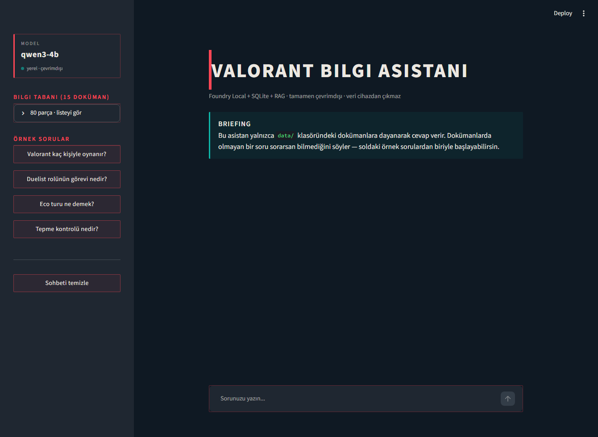
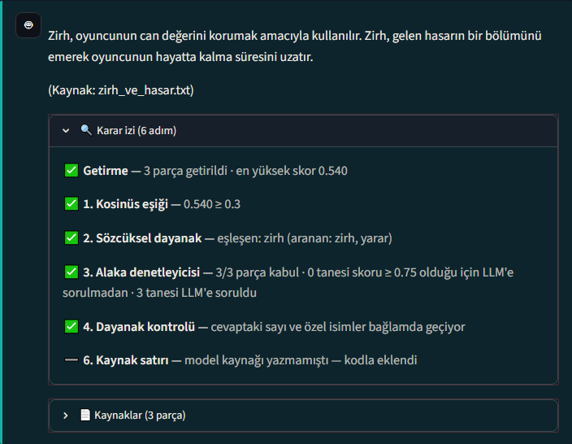
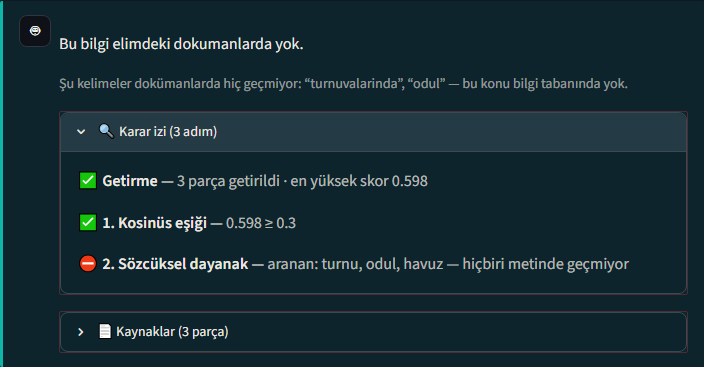
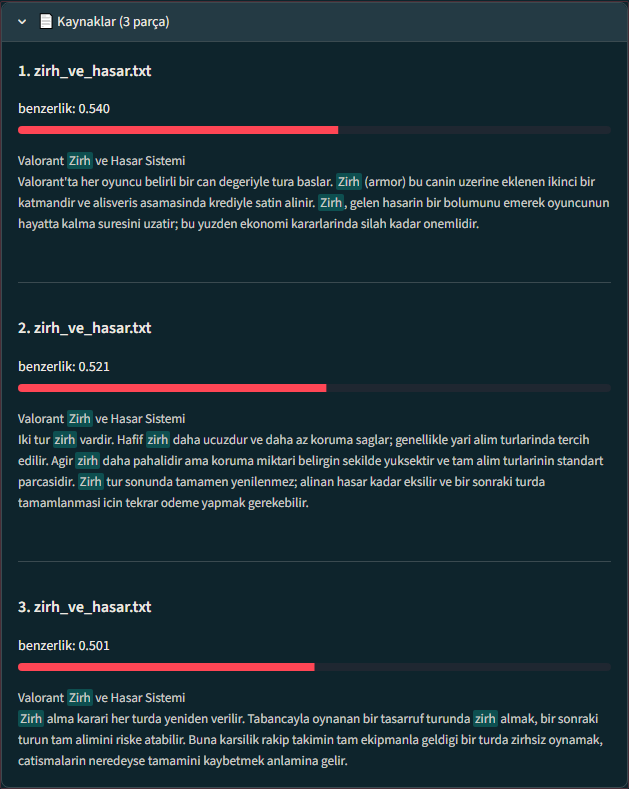

# Valorant Bilgi Asistanı

Microsoft Foundry Local, SQLite ve RAG (Retrieval-Augmented Generation) deseni kullanan,
**tamamen çevrimdışı** çalışan bir soru-cevap asistanı. Valorant hakkındaki 15 dokümana
dayanarak soru cevaplar; internet bağlantısı, bulut hesabı veya API anahtarı
gerektirmez, veri cihazdan çıkmaz.

Projenin odaklandığı asıl konu şu: **dokümanlarda cevabı olmayan bir soru
sorulduğunda ne oluyor?** Basit bir RAG kurgusunda model uydurmaya başlıyor. Bu
yüzden soru, cevap üretilmeden önce üç, üretildikten sonra iki kontrolden geçiyor.
Bu kontrollerin çoğu modele hiç soru sormuyor; kararı kod veriyor.

Her kontrolün gerçekten gerekli olup olmadığı
[tek tek kapatılarak ölçüldü](#ablasyon-çalışması-her-katman-gerçekten-gerekli-mi):
hiç kontrol olmayan bir RAG, cevaplanamaz 4 sorudan 3'üne uydurma cevap veriyor.

**Arayüz:** sohbet geçmişi, token token akan cevaplar (streaming), kenar çubuğunda
bilgi tabanının içeriği (hangi doküman, kaç parça) ve her cevabın altında
**karar izi paneli** — boru hattının hangi kapıda ne karar verdiği, gerekçesiyle
birlikte görünüyor.

Bilgi tabanını değiştirmek için `data/` klasöründeki `.txt` dosyalarını değiştirip
`python ingest.py` çalıştırmak yeterli.



## Ekran Görüntüleri

**Cevap ve karar izi.** Her cevabın altında boru hattının hangi kontrolde ne karar
verdiği, gerekçesiyle birlikte görünüyor. Aşağıdaki örnekte son satır dikkat çekici:
model kaynak satırını yazmayı atlamış, kod tamamlamış.



**Dokümanlarda olmayan bir soru.** Kosinüs skoru **0.598** ile eşiği geçiyor, yani
metin "alakalı" görünüyor — ama sorulan kelimelerin hiçbiri dokümanlarda yok ve
sözcüksel kapı cevabı durduruyor. Kullanıcıya hangi kelimelerin eksik olduğu da
söyleniyor.



**Kaynak paneli.** Cevabın dayandığı parçalar, benzerlik skorlarıyla birlikte
listeleniyor; sözcüksel kapının eşleştirdiği kelimeler metin içinde vurgulanıyor.



## Mimari

```
Kullanıcı (Streamlit arayüzü)
        │
        ▼
  answer_query()  ──────────────►  retrieval.py (get_top_chunks)
   (app.py)                              │
        │                                ▼
        │                        SQLite (rag.db) — dokuman parçaları + embedding vektörleri
        │                                ▲
        ▼                                │
  Foundry Local (qwen3-4b, sohbet)       ingest.py (dokümanları parçalayıp vektörleştirir)
  http://127.0.0.1:<port>/v1             │
        ▲                                ▼
        └──────── Foundry Local (qwen3-embedding-0.6b, embedding) ────────┘
```

- **İstemci katmanı:** Streamlit arayüzü (`app.py`)
- **Pipeline katmanı:** `answer_query()` — retrieval + prompt oluşturma + LLM çağrısı
- **Veri katmanı:** SQLite (`rag.db`), tek tablo: `chunks(id, source, chunk_index, content, embedding)`
- **AI katmanı:** Microsoft Foundry Local, yerel OpenAI-uyumlu bir REST servisi sunar

## Kullanılan Modeller

| Model | Görev | Boyut |
|---|---|---|
| `qwen3-4b` | Sohbet / cevap üretme | 2.6 GB |
| `qwen3-embedding-0.6b` | Embedding (metin → vektör) | 478 MB |

**Not — model seçimi:** Referans doküman `phi-3.5-mini` öneriyordu; test sırasında bu
modelin Türkçe cevaplarda tutarsız/halüsinasyonlu olduğu tespit edildi (İngilizce'de
sorun yoktu). Bu yüzden `qwen3-4b`'ye geçildi.

## Kurulum

```bash
# 1) Foundry Local'i kur (bir kere)
winget install Microsoft.FoundryLocal

# 2) Bağımlılıkları kur
pip install -r requirements.txt

# 3) Foundry Local servisini başlat
foundry server start

# 4) Modelleri indir ve belleğe yükle (bir kere)
foundry model download qwen3-4b
foundry model download qwen3-embedding-0.6b
foundry model load qwen3-4b
foundry model load qwen3-embedding-0.6b
```

## Çalıştırma

```bash
# Dokümanları işle (data/*.txt -> rag.db)
python ingest.py

# Arayüzü başlat
python -m streamlit run app.py
```

Tarayıcıda `http://localhost:8501` açılır. Kendi dokümanlarını eklemek için `data/`
klasörüne `.txt` dosyaları koyup `python ingest.py`'ı tekrar çalıştırmak yeterli
(veritabanı her seferinde sıfırdan oluşturulur).

## Dosya Yapısı

| Dosya | Görev |
|---|---|
| `common.py` | Foundry Local servisine bağlanma (dinamik port keşfi), model isimleri |
| `ingest.py` | Dokümanları parçalayıp (chunk) vektörleştirip SQLite'a yazar |
| `retrieval.py` | Soruyu vektörleştirip kosinüs benzerliğiyle en alakalı parçaları bulur |
| `lexical_gate.py` | Sözcüksel alaka kapısı — konu kaymasını deterministik olarak yakalar |
| `app.py` | Streamlit arayüzü + LLM entegrasyonu (RAG'ın "generate" adımı) |
| `test_qa.py` | Fonksiyonel test seti — cevaplanabilir/cevaplanamaz sorularla doğrulama |
| `ablation.py` | Ablasyon çalışması — her savunma katmanının katkısını ölçer |
| `data/` | Bilgi tabanı — 15 Valorant dokümanı (.txt) |
| `TEST_RESULTS.md` | Son test koşusunun sonuçları (otomatik üretilir) |
| `ABLATION_RESULTS.md` | Ablasyon çalışmasının sonuçları (otomatik üretilir) |

## Tasarım İlkesi: kesin hesaplanabilen şeyi modele sorma

Sistemdeki bütün kontroller tek bir ilkeden çıkıyor. Bu ilkeye, üç ayrı denemenin
ölçülerek başarısız olması sonucunda ulaşıldı.

**Popüler bir konu seçmek işi zorlaştırıyor.** Valorant çok bilinen bir oyun
olduğu için model, dokümanlarda olmayan bilgiyi kendi eğitim verisinden
verebiliyor: *"Valorant 2020'de çıktı"* — bilgi doğru, ama dokümanlarda yok.
Cevap doğru göründüğü için fark edilmesi de zor.

**Kosinüs eşiği tek başına yetmedi.** Bütün dokümanlar aynı konu hakkında
olduğunda skor, *"bu parça soruyu cevaplıyor mu"*yu değil *"bu metin Valorant
hakkında mı"*yı ölçmeye başlıyor. Ölçülen değerler: dokümanlarda cevabı olmayan
sorular bile **0.53 - 0.60** alıyordu. Eşik 0.50'den 0.75'e çekildi, ancak asıl
çözüm bu olmadı.

**Modele kendi cevabını denetletmek işe yaramadı.** Üretimden sonra
*"cevaptaki bilgi bağlamda geçiyor mu?"* diye soran bir kontrol eklendi ve üç
farklı promptla denendi:

| Denenen prompt | Sonuç |
|---|---|
| "Bilgi bağlamda geçiyor mu?" | Model kendi halüsinasyonunu "dayanaklı" diye onayladı |
| "Her şey metinde geçiyor mu?" | Geçerli cevapları da eledi |
| "Uydurma var mı?" | Yeniden ifade edilmiş doğru cevapları uydurma sandı |

Sebebi basit: o bilgiyi zaten "bilen" model, kontrol yaparken de aynı hataya
düşüyor. Aynı modelin kendi hatasını yakalaması beklenemez.

**Varılan sonuç:** kodla kesin olarak hesaplanabilen hiçbir şey modelden
istenmiyor. Bu ilke dört yerde uygulandı — sayı doğrulaması, özel isim dayanağı,
sözcüksel kapı ve cevap uzunluğu. Model yalnızca gri bölgedeki alaka kararında
kullanılıyor, çünkü orada kesin bir ölçüt yok.

## Test Sonuçları

`data/` klasörü Valorant hakkında **15 doküman** (80 parça) içeriyor.
`python test_qa.py` ile 19 soruluk bir ana test seti (15 cevaplanabilir +
4 cevaplanamaz) ve ayrıca 3 uç durum vakası çalıştırılıyor:

- **19 / 19 ana test geçti** — her doküman en az bir soruyla kapsanıyor
- **3 / 3 uç durum testi geçti** (boş sorgu, yalnızca boşluk, çok genel soru)
- **Ortalama süre: 1.61 saniye/soru** (temiz sunucu durumunda ölçüldü), hedeflenen
  1-3 saniye aralığının içinde. Cevaplanamaz soruların çoğu **0.07 saniyede**
  reddediliyor, çünkü sözcüksel kapı hiçbir LLM çağrısı yapmadan karar veriyor.

Test seti yalnızca "cevap üretildi mi" diye bakmıyor; cevaplanabilir sorularda
**cevabın içeriğini de** denetliyor: uzunluk sınırı, bağlamın birebir kopyalanıp
kopyalanmadığı ve kaynak satırının bulunup bulunmadığı. Bu kontroller şu yüzden var: testler
tamamen geçerken arayüzde modelin bağlam metnini kelimesi kelimesine tekrarladığı
fark edildi — test yalnızca "cevap üretildi mi" diye baktığı için bunu hata
saymıyordu.

**Kopyalama ölçütü nasıl kalibre edildi:** İlk sürüm *"cevapta 120 karakterlik
birebir bir bölüm varsa kopyalamadır"* diyordu. Yeni dokümanlar eklenince bu ölçüt
tetiklendi ve incelendiğinde iki şey ortaya çıktı. Birincisi, ölçütün kendisi
kusurluydu: bağlamı üç kez tekrarlayan bir cevapta en uzun birebir bölüm toplam
uzunluğun üçte biri kalıyor ve **asıl önlenmek istenen hata gözden kaçıyordu**.
Ölçüt "en uzun alıntı" yerine **toplam kapsanan oran** olarak yeniden yazıldı ve
üç yeniden-üretim biçiminin de yakalandığı doğrulandı. İkincisi, model gerçekten
kopyalıyordu: cevabın %83'ü birebir alıntıydı. Prompt'a "kopyalama" talimatı
eklenip üç kez denendi, **üçünde de aynı çıktı geldi** — talimatla çözülmüyor.
Model çıkarımda (extraction) iyi, sentezde zayıf; cevabı tek bir kaynak cümlesinde
duran sorularda neredeyse birebir alıntı üretiyor.

**Uç durumlar neden ayrı bölümde:** bu girdiler için "doğru cevap" tek bir şey
değil; beklenen davranış sistemin bunları sağlıklı karşılaması. Ölçüt: **çökmedi +
makul cevap döndü**. Ana sete "bilmiyorum demeli" beklentisiyle konsalardı,
"Bana her şeyi anlat" gibi genel bir soru 0.30-0.75 gri bölgesine düşüp alaka
denetleyicisine gider ve GPU çıkarımı tam deterministik olmadığı için sonuç
koşudan koşuya değişebilirdi.

Güncel sonuçlar için `TEST_RESULTS.md` dosyasına bakın.

## Ablasyon Çalışması: her katman gerçekten gerekli mi?

Bir sistemde beş ayrı savunma katmanı varsa, "hepsi gerekli" demek bir **iddiadır**.
İddia ancak katman kapatılıp sonuç ölçülerek kanıtlanır. `python ablation.py` her
katmanı tek tek kapatıp testi yeniden koşar:

| Yapılandırma | Ana test | Katkısı |
|---|---|---|
| **Tam sistem** | **19/19** | referans |
| Sözcüksel kapı kapalı | 18/19 | **1 vaka** |
| Özel isim kontrolü kapalı | 18/19 | **1 vaka** |
| LLM alaka denetleyicisi kapalı | 19/19 | 0 vaka |
| Sayı doğrulaması kapalı | 19/19 | 0 vaka |
| Kosinüs eşiği kapalı | 19/19 | 0 vaka |
| **Çıplak RAG** (hiç savunma yok) | **16/19** | **3 vaka** |

Tablodan üç sonuç çıkıyor:

**1. Kontrolsüz RAG, cevaplanamaz 4 sorudan 3'ünü kaybediyor.** Yani bu kontroller
projenin süsü değil, çalışmasının şartı.

**2. En büyük katkıyı iki deterministik kontrol sağlıyor.** Sözcüksel kapı ve özel
isim kontrolü — ikisi de hiç LLM çağrısı yapmıyor.

**3. Üç kontrol bu test setinde 0 vaka katıyor.** Bu sonuç "silinmeliler" anlamına
gelmiyor; daha büyük ihtimalle **test seti o kontrollerin savunduğu hata tipini
içermiyor**. Nitekim tam da böyle bir açık bulundu (aşağıda) ve teste eklendi.

Bu tablo bilgi tabanı büyütülürken üç kez yeniden ölçüldü (6, 10 ve 15 doküman).
Her katmanın kurtardığı vaka sayısı değişmedi — yani sonuçlar tek bir korpus
boyutuna özgü bir tesadüf değil.

### Ablasyonun bulduğu açık

"LLM alaka denetleyicisi 0 vaka katıyor" sonucu çıkınca katman silinmedi; önce şu
soruldu: *bu katman neyi savunuyordu, test seti onu ölçüyor mu?* Ölçmüyordu.
Eksik olan vaka şuydu — **kelimeleri dokümanlarda geçen ama cevabı geçmeyen soru**:

```
Soru : "Duelist rolündeki ajanların isimleri nelerdir?"
Cevap: "Jett, Sage, Raze ve Breach'tir. (Kaynak: ajan_rolleri.txt)"
```

Dokümanlarda **hiçbir ajan ismi geçmiyor.** Sistem uydurdu, üstüne bir de kaynak
gösterdi — yani yanlış bilgi güvenilir göründü (bilgi ayrıca hatalı: Sage
sentinel, Breach initiator). Hiçbir kontrol yakalayamadı: sözcüksel kapı `duelist`
eşleştiği için geçirdi, sayı kontrolü rakam olmadığı için göremedi.

Çözüm, sayı kontrolünün genişletilmesiyle bulundu: **cevapta geçen ama bağlamda
hiç geçmeyen özel isimler**. Model kendi cümlesiyle anlatırken yeni bir özel isim
uydurmaz; ortaya çıkan bir isim varsa o bilgi bağlamdan gelmiyordur. Eklenmeden
önce geçerli cevaplara karşı denendi: **0 yanlış eleme**.

## Tasarım Kararları ve Kısıtlar

- **Vektör arama:** SQLite'ın native vektör tipi yok; embedding'ler JSON-serileştirilmiş
  metin olarak saklanıyor, benzerlik hesaplaması (kosinüs) Python/NumPy ile brute-force
  yapılıyor. Küçük veri setleri (birkaç yüz parça) için yeterli; büyük ölçekte özel bir
  vektör indeksi (FAISS, pgvector vb.) gerekir.
- **Neden `foundry-local-sdk` yerine `openai` istemcisi:** `foundry-local-sdk` kendini
  *"control-plane SDK"* olarak tanımlıyor ve `FoundryLocalManager` sınıfı yalnızca
  model/servis yönetimi metotları içeriyor (`discover_eps`,
  `download_and_register_eps`, `start_web_service`, `stop_web_service`); **çıkarım
  (inference) için hiçbir metodu yok** ve paketin kendi bağımlılıkları arasında zaten
  `openai` var. Foundry Local servisi OpenAI-uyumlu bir yerel REST ucu açtığı için
  (`http://127.0.0.1:<port>/v1`), çıkarım doğrudan `openai` istemcisiyle bu uca
  yapılıyor — yani SDK atlanmış değil, SDK'nın da kullandığı çıkarım yolu doğrudan
  kullanılıyor. Servis yönetimi (port keşfi, model yükleme) ise `foundry` CLI
  üzerinden yapılıyor: servisin portu her başlatmada değişebiliyor, bu yüzden
  `foundry server status -o json` çıktısındaki `webUrls` alanı okunuyor.

- **`/no_think` yönergesi:** `qwen3-4b` bir "reasoning" modeli olduğu için varsayılan
  olarak cevaptan önce uzun bir iç düşünme adımı üretiyor. Bu hem yavaşlığa hem de
  (bazı sorularda) düşünme döngüsüne girip hiç bitirmeme riskine yol açtı. Sistem
  promptuna `/no_think` eklenerek bu adım kapatıldı — süre ortalama ~10 kat kısaldı.
- **`max_tokens` sınırı:** Modelin sınırsız üretim yapmasını önlemek için bir güvenlik
  sınırı olarak tutuluyor.
- **Çıktı temizleme:** Model bazen Türkçe cevap içine tek karakterlik CJK (Çince/Japonca/
  Korece) karakterler sıkıştırıyor (gözlemlenen bir küçük-model kusuru); bu karakterler
  cevap gösterilmeden önce regex ile temizleniyor.
- **Sözcüksel kapı (hibrit arama):** Sorunun ayırt edici kelimelerinden en az biri
  getirilen metinde geçmiyorsa, o metin bu soruyu cevaplıyor olamaz — kosinüs skoru
  ne kadar yüksek görünürse görünsün. Gerekçesi ve ölçümü için yukarıdaki
  [ablasyon bölümüne](#ablasyon-çalışması-her-katman-gerçekten-gerekli-mi) bakın.

  *"Ayırt edici"* tanımı kritik: `valorant` her dokümanda geçtiği için hiçbir şey
  ayırt etmiyor, bu yüzden doküman frekansı yüksek kelimeler eleniyor (**IDF**
  fikrinin sade bir uygulaması). Türkçe için iki uyarlama gerekti: karakter
  normalizasyonu (dokümanlar Türkçe karaktersiz, kullanıcı `görevi` yazıyor) ve
  kaba gövde karşılaştırması (sondan eklemeli dil: `turnuva` → `turnuvalarında`).

  Kapı **toleranslı**: tek eşleşme yeterli. Amaç geçerli soruları elemek değil,
  hiçbir sözcüksel dayanağı olmayanları yakalamak. Sorunun hiç ayırt edici kelimesi
  yoksa ("Bana her şeyi anlat") kapı karar veremez ve geçirir. Entegrasyondan önce
  tüm test sorularına karşı ölçüldü: **0 yanlış eleme**. LLM çağrısından önce
  çalıştığı için ek kazanç hız: cevaplanamaz sorular **0.08 saniyede** reddediliyor.

- **Halüsinasyon karşı önlemi — üç bölgeli alaka kararı:** Sözcüksel kapıyı geçen
  parçalar için karar şöyle veriliyor:
  - `skor >= 0.75` → kesin alakalı, LLM'e sorulmaz (deterministik + hızlı)
  - `skor < 0.30` → kesin alakasız, LLM'e sorulmaz (deterministik + hızlı)
  - arada (gri bölge) → **alaka denetleyicisine** sorulur

  **Alaka denetleyicisi (relevance grader) neden var:** Küçük dil modelleri
  "bağlamda cevap yoksa cevap verme" gibi *açık uçlu* bir talimatı güvenilir
  uygulayamıyor (test edildi, halüsinasyon yaptı). Ama aynı model, *"bu metin bu
  soruyu cevaplıyor mu? EVET/HAYIR"* şeklindeki **ikili sınıflandırma** görevinde
  belirgin biçimde daha başarılı. Bu yüzden gri bölgedeki her parça ayrı ayrı bu
  soruyla denetleniyor, sadece geçenler cevap üretimine gönderiliyor. (Literatürde
  "retrieval grading" / CRAG deseni olarak biliniyor.)

  **Neden üç bölge:** GPU çıkarımı tam deterministik olmadığı için aynı soru farklı
  koşularda farklı sonuçlanabiliyor. Skorun net olduğu durumlarda kararı koda bırakmak
  hem bu kararsızlığı azaltıyor hem de gereksiz LLM çağrılarını eleyerek hızlandırıyor.
  Üst eşik başta 0.50'ydi; tek konulu (Valorant) bir korpusta bunun yetersiz kaldığı
  ölçülüp 0.75'e çıkarıldı (bkz. "En değerli bulgu" bölümü).

- **Dayanak kontrolü (son savunma katmanı):** Üretilen cevapta, bağlamda hiç geçmeyen
  bir sayı varsa cevap reddedilip "bilmiyorum" dönülüyor. Bu kontrol bilinçli olarak
  **deterministiktir** — LLM'e sorulan bir dayanak kontrolü denendi ve model kendi
  halüsinasyonunu onayladığı için başarısız oldu.

- **Kaynak gösterimi de deterministik:** Sistem promptunun 5. kuralı modelden cevabın
  sonuna `(Kaynak: dosya.txt)` satırını eklemesini istiyor. Teste bu kural için bir
  doğrulama eklendiğinde ölçüldü ki **model bunu cevapların yaklaşık üçte birinde
  atlıyor** (o ölçümde 6 cevaplanabilir sorudan 2'sinde). Kaynak dosya adı retrieval aşamasından
  zaten elimizde olduğu için, satır eksikse kodla ekleniyor
  (`ensure_source_citation`). Prompt kuralı yine duruyor; model kendiliğinden doğru
  yazdığında bu fonksiyon hiçbir şey yapmıyor. Aynı ilke: kesin bilinen bir bilgi
  modelden istenmez, kodla yazılır.

- **Özel isim dayanağı:** Cevapta geçen ama bağlamda hiç geçmeyen özel isim varsa
  cevap reddediliyor (`lexical_gate.ungrounded_proper_nouns`). Sayı kontrolünün
  göremediği halüsinasyon türünü yakalar. Yanlış pozitifi düşük tutan iki kural:
  cümle başındaki kelimeler sayılmaz (her cümle büyük harfle başlar) ve
  karşılaştırma normalize edilmiş kaba gövde üzerinden yapılır.

- **Cevap uzunluğu kodla sınırlanıyor:** Sistem promptunun 1. kuralı "en fazla
  3 cümle" diyor — ama bu bir *talep*, garanti değil. Belirsiz sorularda model
  kuralı görmezden gelip 1000-1300 karakterlik metinler üretebiliyordu (ölçüldü,
  koşudan koşuya değişiyordu). `limit_answer()` iki sınırı birlikte uyguluyor:
  en fazla 3 birim (cümle **ya da** madde satırı — model bazen noktalama
  kullanmayan listeler ürettiği için satır sonu da sınır sayılıyor) ve 700 karakter.
  Karakter sınırı, tek bir birim tek başına sınırı aşsa bile uygulanıyor: kesim
  kelime sınırından yapılıyor. Bu ikinci kural sonradan eklendi — ilk sürümde
  "en az bir birim her zaman kalsın" kuralı, virgülle bağlanmış tek parça uzun
  bir cevabı hiç kırpmadan geçiriyordu (arayüzde gözlemlendi).

- **Yinelenme döngüsü tespiti:** Küçük modeller ara sıra aynı ifadeyi onlarca kez
  tekrarlayan bir döngüye giriyor. Arayüzde gözlemlenen örnek: *"Çapraz ateş nedir?"*
  sorusuna gelen cevap, aynı yan cümleyi ~20 kez tekrarlayan 1000+ karakterlik bir
  metindi. Bu çıktı **kırpılarak düzeltilemez** — kırpılmış hâli de anlamsız kalır.

  Ölçüt deterministik: **benzersiz kelime oranı**. Sağlıklı bir cevapta kelimelerin
  büyük bölümü farklıdır (ölçülen değerler 0.7 üzeri); döngüye giren bir çıktıda
  aynı birkaç kelime tekrarlandığı için bu oran çok düşer (eşik 0.35, 30 kelimenin
  altındaki cevaplar değerlendirilmez). Döngü tespit edilirse cevap bir kez daha
  üretiliyor; ikinci deneme de döngüye girerse kullanıcıya hiç gösterilmiyor.
  Aynı kontrol test setine de eklendi, böylece bir daha olursa sessizce geçmez.

- **Uç durumlar:** Boş sorgu, yalnızca boşluk içeren sorgu ve çok genel sorular
  `test_qa.py` içinde ayrı bir bölümde test ediliyor (3/3 geçti).

- **Boş sorgu koruması:** Boş veya yalnızca boşluk içeren bir sorgu doğrudan embedding
  API'sine gittiğinde Foundry Local HTTP 400 dönüyor
  (`Embedding input at index 0 is null, empty...`) ve bu yakalanmayan bir exception
  olarak uygulamayı çökertiyordu. Arayüzden tetiklenmiyordu (`st.chat_input` boş girdi
  göndermiyor), ancak fonksiyon doğrudan çağrıldığında çöküyordu. Kontrol
  `retrieve_and_gate()` başına konuldu — hem akışsız (test) hem akışlı (arayüz) yol
  buradan geçiyor.

## Karar İzi Paneli

RAG boru hattı dışarıdan tamamen görünmez çalışır: ekranda yalnızca cevap (ya da
"bilmiyorum") belirir, o kararı **hangi kontrolün** verdiği görünmez. Bu durum hem
hata ayıklamayı zorlaştırıyor hem de kullanıcı açısından belirsizlik yaratıyor —
"bilmiyorum" diyen bir asistan bakıp da mı bulamadı, yoksa hiç bakmadı mı?

Bu yüzden her cevabın altına **🔍 Karar izi** paneli eklendi. Gerçek çıktılar:

```
Soru: "Duelist rolünün görevi nedir?"
  ✅ Getirme               3 parça getirildi · en yüksek skor 0.569
  ✅ 1. Kosinüs eşiği      0.569 ≥ 0.3
  ✅ 2. Sözcüksel dayanak  eşleşen: dueli (aranan: dueli, rolun)
  ✅ 3. Alaka denetleyicisi 3/3 parça kabul · 3 tanesi LLM'e soruldu
  ✅ 4. Dayanak kontrolü   cevaptaki sayı ve özel isimler bağlamda geçiyor
  ➖ 6. Kaynak satırı      model kaynağı yazmamıştı — kodla eklendi

Soru: "Valorant turnuvalarında ödül havuzu ne kadar?"
  ✅ Getirme               3 parça getirildi · en yüksek skor 0.598
  ✅ 1. Kosinüs eşiği      0.598 ≥ 0.3
  ⛔ 2. Sözcüksel dayanak  aranan: turnu, odul, havuz — hiçbiri metinde geçmiyor
```

İkinci örnek kosinüs benzerliğinin neden yetmediğini tek bakışta gösteriyor: skor
**0.598** ile gayet "alakalı" duruyor, ama sorulan kelimelerin hiçbiri metinde yok.
Panelde ayrıca hangi kararların **hiç LLM çağrısı yapılmadan** verildiği de
görünüyor.

## "Bilmiyorum" Neden Bilmiyorum

"Bu bilgi elimdeki dokümanlarda yok" cevabı tek başına kullanıcıyı çıkmaza
sokuyor: sorusu mu yanlış anlaşıldı, yoksa bilgi gerçekten yok mu, anlaşılmıyor.
Sözcüksel kapı bu bilgiyi zaten hesapladığı için kullanıcıya da gösteriliyor:

```
Soru: "Valorant turnuvalarında ödül havuzu ne kadar?"
  Bu bilgi elimdeki dokumanlarda yok.
  Şu kelimeler dokümanlarda hiç geçmiyor: "turnuvalarinda", "odul"
  — bu konu bilgi tabanında yok.
```

Bu not yalnızca **sözcüksel kapının reddettiği** durumlarda çıkıyor; diğer
kapıların reddi farklı bir sebebe dayanır ve orada eksik kelime listesi
yanıltıcı olurdu. Cevabın kendisi değişmiyor, bu sadece altına eklenen bir açıklama.

Aynı mantığın görsel karşılığı kaynak panelinde: sözcüksel kapının eşleştirdiği
kelimeler doküman metni içinde **vurgulanıyor**. Kararı okumak yerine, kararın
dayandığı kelimeler metnin içinde doğrudan görülüyor.

## İşletim Notu — GPU belleği ve süre ölçümü

Foundry Local arka arkaya çok istek aldığında GPU belleğini biriktiriyor ve üretim
süreleri belirgin şekilde yavaşlıyor. **Bu bir kod hatası değil**, servisin bellek
davranışı. Ölçülen değerler (RTX 4060 Ti, 8 GB VRAM):

| Durum | GPU belleği | Ortalama süre |
|---|---|---|
| Servis yeni başlatılmış | 5581 MiB | **1.43 sn/soru** |
| Tek test koşusu sonrası | 7798 MiB | — |
| Birkaç ardışık koşu sonrası | ~7900 MiB (%96) | 4.7 - 8.6 sn/soru |

Ayırt edici kanıt: yavaşlama **yalnızca üretim yapan** soruları etkiliyor; kapıda
reddedilen sorular her durumda 0.06 saniyede dönüyor (GPU'ya hiç gitmiyorlar).

Bu yüzden README'deki süre değerleri **temiz sunucu durumunda** ölçülmüştür.
Kendi ölçümünü yapacaksan önce:

```bash
foundry server restart
foundry model load qwen3-embedding-0.6b
foundry model load qwen3-4b
```

## Kaynaklar

Projede takip edilen kaynaklar:

**Ana referans (topluluk içeriği):**
- [Building Your First Local RAG Application with Foundry Local](https://techcommunity.microsoft.com/blog/azuredevcommunityblog/building-your-first-local-rag-application-with-foundry-local/4501968)
  — Microsoft Tech Community

**Resmi Microsoft Learn dokümantasyonu:**
- [What is Foundry Local?](https://learn.microsoft.com/en-us/azure/foundry-local/what-is-foundry-local)
- [Foundry Local dokümantasyonu](https://learn.microsoft.com/en-us/azure/foundry-local/)
  — kurulum ve "Get started" adımları
- [Tutorial: Build a RAG application](https://learn.microsoft.com/en-us/azure/foundry-local/tutorials/tutorial-build-rag-app)
  — özellikle "Generate document embeddings" ve "Search for relevant documents"
  bölümleri; bu projedeki `get_top_chunks()`, tutorial'daki `find_relevant()`
  fonksiyonunun SQLite'a taşınmış hâli
- [Prompt engineering techniques](https://learn.microsoft.com/en-us/azure/foundry/openai/concepts/prompt-engineering)
  — sistem mesajı tasarımı ve prompt kurgusunun temelleri
- [Tutorial: Use a SQLite database in a Windows app](https://learn.microsoft.com/en-us/windows/apps/develop/data-access/sqlite-data-access)
  — SQLite'ın yerel depolama için avantajları

**Diğer:**
- [SQLite resmi dokümantasyonu](https://www.sqlite.org/) — veritabanı motoru

**Yapay zekâ desteği:** Geliştirme sürecinde Claude (Anthropic) asistanından
yararlanılmıştır; özellikle hata ayıklama, kod gözden geçirme ve dokümantasyon
aşamalarında. Bu belgedeki bütün ölçümler bu makinede çalıştırılarak elde edilmiş
olup `python test_qa.py` ve `python ablation.py` ile yeniden üretilebilir.

### Bilgi tabanı hakkında

`data/` klasöründeki 15 doküman bu proje için yazıldı; herhangi bir kaynaktan
kopyalanmadı. İçerik bilinçli olarak **yamadan bağımsız** tutuldu: ajan isimleri,
harita listeleri, silah fiyatları ve benzeri sürümle değişen ayrıntılar yerine
oyunun kalıcı mekanikleri anlatılıyor (ekonomi mantığı, rol işlevleri, tur akışı,
konumlanma ilkeleri). Böylece bilgi tabanı her oyun güncellemesinde eskimiyor.

Oyunla ilgili bilgileri doğrulamak veya bilgi tabanını genişletmek için resmî
kaynaklar:

- [VALORANT Beginner's Guide](https://playvalorant.com/en-us/news/announcements/beginners-guide/)
  — Riot Games'in resmî başlangıç rehberi
- [VALORANT Support](https://support-valorant.riotgames.com/hc/en-us)
  — oyun mekanikleri ve sistemler hakkında resmî destek dokümantasyonu
- [playvalorant.com](https://playvalorant.com/en-us/) — oyunun resmî sitesi

Bilgi tabanını değiştirmek için `data/` klasörüne `.txt` dosyaları ekleyip
`python ingest.py` çalıştırmak yeterli.
